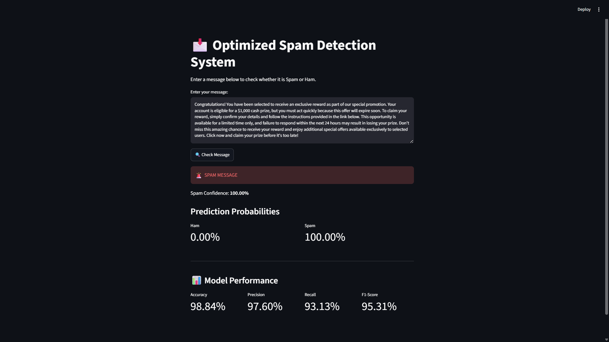
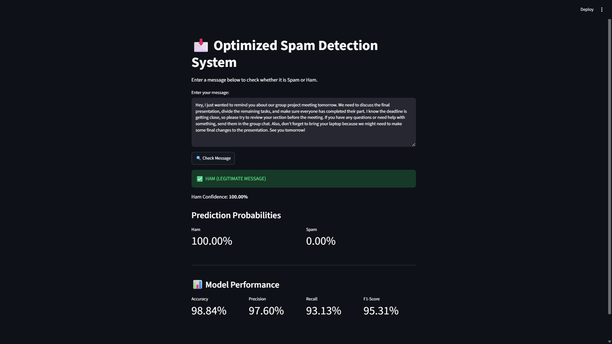

# 📩 Optimized Spam Detection System

A Machine Learning-based SMS Spam Detection System designed to classify messages as either **Spam** or **Ham**.

The project implements a complete Machine Learning pipeline, starting from data preprocessing and feature extraction, through model training and evaluation, to optimization and deployment using **Streamlit**.

---

## 🎯 Project Objective

The main goal of this project is to build an accurate and reliable system for detecting spam messages.

The project includes:

- Data cleaning and preprocessing
- Feature extraction using text vectorization techniques
- Training multiple Machine Learning models
- Comparing model performance using different evaluation metrics
- Hyperparameter tuning and optimization
- Selecting the best-performing model
- Deploying the final model using Streamlit

---

## 🛠️ Technologies Used

- Python
- Pandas
- NumPy
- Scikit-learn
- Matplotlib
- Seaborn
- Joblib
- Streamlit
- Git & GitHub

---

## 🔄 Project Workflow

```text
SMS Dataset
    │
    ▼
Data Preprocessing
    │
    ▼
Feature Engineering
    │
    ├── CountVectorizer
    └── TF-IDF Vectorizer
    │
    ▼
Model Training
    │
    ├── Multinomial Naive Bayes
    ├── Logistic Regression
    └── LinearSVC
    │
    ▼
Model Evaluation
    │
    ▼
Optimization
    │
    ▼
Final Model Selection
    │
    ▼
Streamlit Deployment
```

---

## 🧹 Data Preprocessing

The SMS dataset was prepared before training the Machine Learning models.

The preprocessing process included:

- Checking the dataset structure and columns
- Handling missing values
- Removing duplicate records
- Validating the Spam and Ham labels
- Converting text to lowercase
- Removing unnecessary punctuation and characters
- Cleaning and normalizing text
- Creating a stratified Train/Test split
- Ensuring that data leakage was avoided

---

## 🧠 Feature Engineering

Two feature extraction techniques were used to convert text messages into numerical representations.

### CountVectorizer

Represents text based on the frequency of words in each message.

### TF-IDF Vectorizer

Represents text based on both word frequency and the importance of words across the dataset.

The vectorizers were fitted only on the training data to prevent data leakage.

---

## 🤖 Machine Learning Models

The following models were trained and compared:

- Multinomial Naive Bayes
- Logistic Regression
- LinearSVC

Each model was tested using both **CountVectorizer** and **TF-IDF Vectorizer** to compare different feature configurations.

---

## 📊 Model Evaluation

The models were evaluated using:

- Accuracy
- Precision
- Recall
- F1-Score
- Classification Report
- Confusion Matrix

The project also includes analysis of:

- False Positives
- False Negatives
- Misclassified messages

This allowed the models to be compared using more than just accuracy.

---

## ⚙️ Optimization & Final Model

Different hyperparameters and feature configurations were tested to improve model performance.

The optimization process included experimenting with parameters such as:

- `alpha`
- `C`
- `ngram_range`
- `min_df`
- `max_df`

The optimized models were compared with the baseline models, and the best configuration was selected based on the evaluation metrics.

---

## 🏆 Final Model

The final model was selected after evaluating and comparing all model configurations.

### 🥇 CountVectorizer + Multinomial Naive Bayes

### Final Performance

| Metric | Score |
|--------|-------|
| Accuracy | **98.84%** |
| Precision | **97.60%** |
| Recall | **93.13%** |
| F1-Score | **95.31%** |

---

## 🌐 Streamlit Application

The final model was deployed using **Streamlit** to provide an interactive interface for spam detection.

Users can:

- Enter an SMS message
- Predict whether the message is **Spam** or **Ham**
- View the prediction result
- View prediction probabilities or confidence when supported
- View information about the model's performance

### 🚨 Spam Prediction



### ✅ Ham Prediction



---

## 🚀 How to Run the Project

### 1. Clone the repository

```bash
git clone https://github.com/MariamMohamed06/Optimized-spam-detector.git
```

### 2. Navigate to the project directory

```bash
cd Optimized-spam-detector
```

### 3. Install the required libraries

```bash
pip install -r requirements.txt
```

### 4. Run the Streamlit application

```bash
python -m streamlit run app.py
```

---

## 👥 Team Contributions

This project was developed collaboratively, with each team member responsible for a specific part of the Machine Learning pipeline.

| Team Member | Responsibilities |
|---|---|
| **Tukka Mohamed** | Data Preprocessing & Preparation + Logistic Regression Model |
| **Mariam Mohamed** | Feature Engineering & Model Training |
| **Ghada Mohamed** | Model Evaluation & Performance Analysis |
| **Ahmed Hesham** | Model Optimization, Final Model Selection & Streamlit Deployment |

### 👩‍💻 Tukka Mohamed

- Data preprocessing and dataset preparation
- Handling missing values and duplicates
- Cleaning and validating SMS messages
- Creating the Train/Test split
- Implementing and training the Logistic Regression model

### 👩‍💻 Mariam Mohamed

- Implementing CountVectorizer and TF-IDF Vectorizer
- Preparing features for model training
- Training the Machine Learning models
- Implementing Multinomial Naive Bayes and LinearSVC
- Saving trained models and vectorizers

### 👩‍💻 Ghada Mohamed

- Evaluating all trained models
- Calculating Accuracy, Precision, Recall, and F1-Score
- Creating Confusion Matrices
- Comparing model performance
- Analyzing False Positives, False Negatives, and misclassified examples

### 👨‍💻 Ahmed Hesham

- Performing hyperparameter tuning and optimization
- Experimenting with different feature configurations
- Comparing baseline and optimized models
- Selecting and validating the final model
- Deploying the model using Streamlit

---

## 📁 Project Structure

```text
Optimized-spam-detector/
│
├── 📄 app.py
├── 📄 README.md
├── 📄 requirements.txt
│
├── 📂 data/
│   ├── 📄 spam.csv
│   └── 📄 cleaned_spam.csv
│
├── 📂 models/
│   ├── 📄 count_vectorizer.pkl
│   ├── 📄 tfidf_vectorizer.pkl
│   ├── 📄 final_count_vectorizer.pkl
│   ├── 📄 final_spam_model.pkl
│   │
│   ├── 📄 countvectorizer_multinomialnb.pkl
│   ├── 📄 countvectorizer_logisticregression.pkl
│   ├── 📄 countvectorizer_linearsvc.pkl
│   │
│   ├── 📄 tf_idf_multinomialnb.pkl
│   ├── 📄 tf_idf_logisticregression.pkl
│   └── 📄 tf_idf_linearsvc.pkl
│
├── 📂 notebooks/
│   ├── 📓 Data Preprocessing.ipynb
│   ├── 📓 Models.ipynb
│   ├── 📓 Evaluation.ipynb
│   └── 📓 Optimization.ipynb
│
├── 📂 outputs/
│   ├── 🖼️ confusion_matrices.png
│   ├── 🖼️ f1_ranking.png
│   ├── 🖼️ metrics_comparison.png
│   ├── 🖼️ spam_streamlit.png
│   ├── 🖼️ ham_streamlit.png
│   ├── 📄 misclassified_examples.csv
│   └── 📄 model_comparison_results.csv
│
└── 📂 src/
    ├── 📄 preprocess.py
    ├── 📄 features.py
    ├── 📄 train.py
    └── 📄 evaluate.py
```

---

## 📌 Conclusion

This project demonstrates an end-to-end Machine Learning pipeline for SMS Spam Detection.

From **data preprocessing** and **feature engineering** to **model training**, **evaluation**, **optimization**, and **Streamlit deployment**, the project demonstrates how Machine Learning can be used to build an effective and practical spam detection system.
